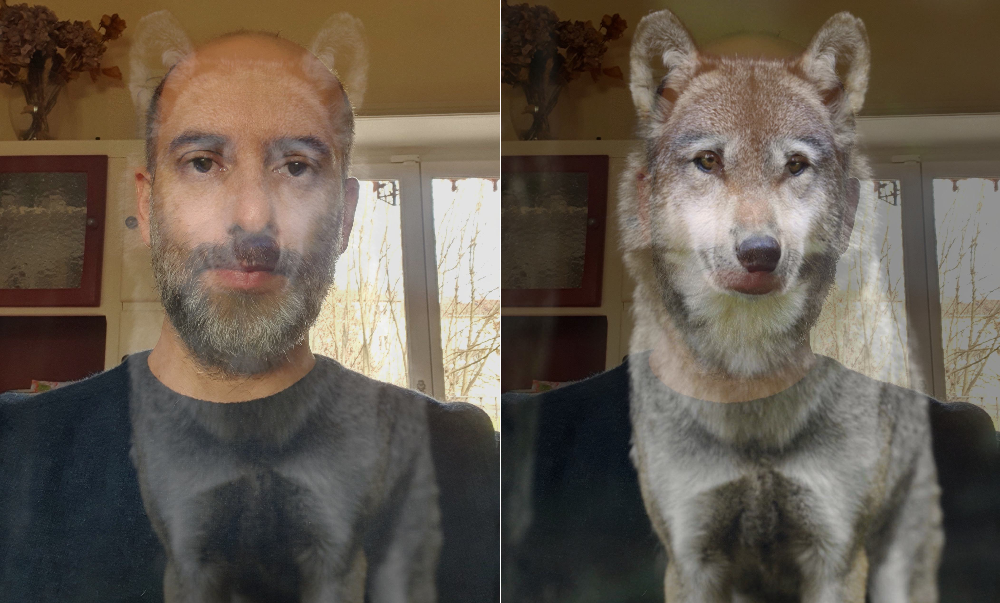
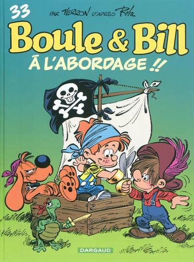
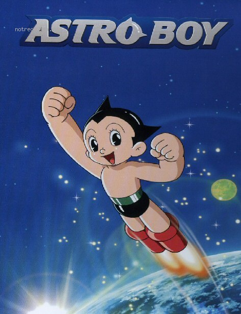
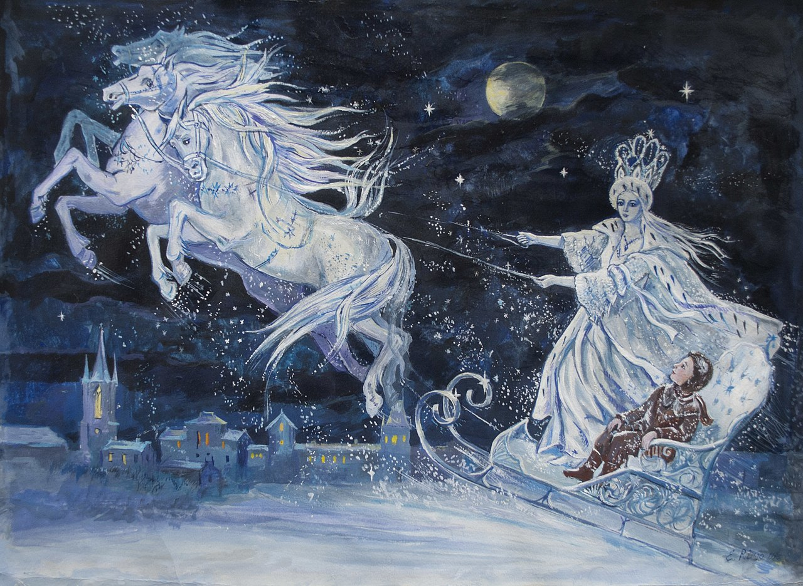
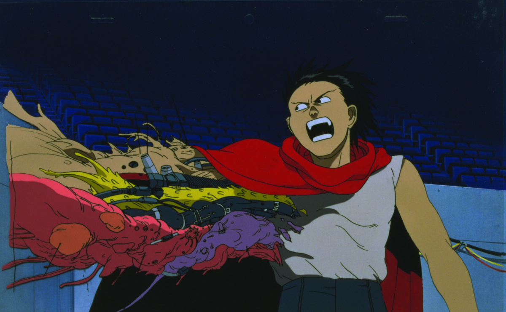
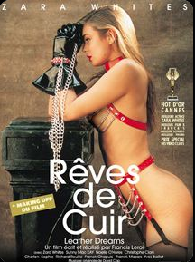

## Introduction
Je m'appelle Julien, j'ai 41ans, et je vis avec un loup intérieur.  
En fait, lorsque je parle de quelque chose que je décrit comme un loup, aujourd'hui, à 41ans, j'essaie de décrire et de donner un corps à des pensées que je peux avoir.  
Je sais que je ne suis qu'une seule et même personne ; mais je me rend compte que je ne peux ou n'arrive souvent pas à être "entier" et qu'il y a une grande part de moi que je n'exprime pas, que je passe sous silence, et qui reste dans l'ombre.  
Ces sortes de non-dits génèrent souvent une gène dans mes interactions avec les autres. La gène peut apparaître dans mon esprit, ou dans celle de mes interlocuteurs, et je me sens très affecté par les difficultés de s'accorder mutuellement.  

En général je suis plutôt du genre à réussir ce que j'entreprend, j'ai un travail intéressant, une belle famille, une belle maison, de belles idées plein la tête...

Malgré cela il y a quelques mois, j'ai eu des idées que je ne pensais jamais possibles ; celle de mettre fin à mes jours, ou celle de faire beaucoup de mal à ceux qui me sont chers et proches de moi.

Ces pensées m'ont vraiment effrayées, et je n'ai pas eu d'acte malveillant, heureusement.  
Je suis allé voir un psy, et j'ai commencé à bouleverser les choses de ma vie.
Cette histoire en fait partie, elle donne un éclairage sur mes ombres, et j'espère que cela pourrait aider d'autres personnes qui se sentiraient proches de ce genre de situation.

## Eveils

Lorsque j'étais petit, comme tout un chacun, j'ai mémorisé des souvenirs qui m'ont marqué. Pourtant assez rapidement j'ai ressenti que je n'arrivais pas à partager suffisament mes sentiments avec les autres, et à me sentir en confiance.

#### mon ami D.
En maternelle j'avais un ami de mon âge ; nous étions nés dans la même maternité à quelques jours d'écarts, nos parents étaient amis et se voyaient souvent, je jouais beaucoup chez lui. Je l'aimais vraiment beaucoup, je pense que je m'étais attaché à lui comme à un frère, mon vrai grand premier ami, à moi. Et je conserve toujours encore sur mon coeur de nombreux souvenirs de cette époque dorée.   

Mais lors du divorce de ses parents quelque choses s'est brisé entre nous ; il a fait le choix de s'éloigner de moi et de jouer avec d'autres amis, et cela a laissé un immense vide sur mon coeur qui m'a poursuivi jusqu'à mes 20 ans.

Parce que je sais que de mon côté je l'aime toujours, et que je ne comprends toujours pas pourquoi il s'est éloigné de moi.

#### ma petite voisine.
Entre 2 et 6 ans j'ai beaucoup joué avec une voisine qui est juste un peu plus jeune que moi. On pouvait être gardé chez l'un ou chez l'autre, et on a eu de très nombreux jeux de petit enfant, avec des cache-cache et des petites luttes... Cela m'a laissé une mémoire très égalitaire dans mes rapports avec les filles. J'ai toujours respecté et admiré leurs forces physiques et mentale, et j'ai toujours aimé lier amitié avec elles.

#### mes petits jeux à moi
Chez moi je prenais énormément de plaisirs à m'enrouler dans ma couverture, et à me faire tomber dans un recoin, je pouvais rester très longtemps ainsi confiné.

#### La cours de récré
Ces petits traits de caractères étaient légers, mais pourtant à l'école je ne m'intégrais pas trop dans les bandes d'amis. La perte de mon grand ami d'enfance était une blessure qui m'accompagnait tous les jours. Je ne comprenais pas pourquoi il ne me trouvais pas intéressant, alors lorsque je le voyait jouer avec les autres je me sentais vraiment nul. Et je n'arrivais plus à avoir envie de nouer une relation avec les autres.
Alors à la cours de récré de mon école, je m'asseyais souvent seul dans un coin ; à observer les autres de loin.

Parfois certains enfants venaient me rendre visite, j'essayais de rendre le change, sans trop y croire.  
Finalement je commençais à aimer observer les autres de loin ; voir comment les gens interagissent.  
J'ai appris à ne pas trop m'attarder sur les détails des histoires que j'observais, ce qui pouvait être "personnels" et ne me concernait pas. Mais j'aimais observer toutes ces expériences de vie...

#### Les repas de familles
Lors des réunions de famille, je n'aimais pas trop interagir avec les autres, il y avait une forme de violence entre les uns et les autres qui me dérangeait toujours. 
C'était surtout le regard des grands qui me dérangeait. Je voyait la compétition et la comparaison un peu partout dans leurs regards.
Lorsqu'ils s'adressaient aux enfants, sous le verni de leurs grands sourires, je pouvait percevoir le jugement : il y avait une forme de compétition à qui faisait le plus beau dessin, ou la plus belle chanson. A qui avait de bonnes notes à l'école...
Et dans leurs discussions entre eux là aussi il y avait des concours d'éloquences et des formes de jeux de pouvoirs que je ne comprenais pas bien.

#### Les refuges
En revanche j'aimais me cacher sous la table ou dans un coin, et écouter les autres, sentir que la vie était proche.
Pour m'éloigner des joutes verbales puériles de adultes, ou de leurs questions lénifiantes, j'allais souvent en cuisine (avec les mamans et cousines exclusivement) soit pour aider à préparer le service, ou bien pour manger de bonnes petites choses en douce.

## Le doudou

Petit à petit, ces souvenirs se sont accumulés en moi, et je les ai réuni au sein d'une sorte de petit doudou intime.
Mon petit loup était né.

#### Ma singularité
Au delà de ces quelques égratignures d'enfance, je remarquais souvent, de manière très répétée, que je n'avais pas les mêmes souvenirs... que je ne comprenais pas les situations, comme mon entourage...
J'avais tendance à faire des pas de côté dans mes relations, à voir les choses sous plusieurs angles, comme pour me protéger d'un risque de violence de la part de l'autre.  
Je cherchais à déceler le jugement dans leurs regard, et à mesurer leurs intentions.  
Le doute était ma philosophie de vie.  
Je m'astreignais à douter de tout, à analyser, à chercher... Et lorsque la méthode scientifique m'a été présentée à l'école je crois que j'ai tout de suite adhéré à cet idéal philosophique.  
Une promesse intérieure se formait en moi ; j'essayerais de toujours faire l'éloge de la raison et de la rigueur, de douter de moi-même, et de mes perceptions du monde qui m'entoure.  

Mon école et notre appartement familial est situé en hauteur au dessus d'une grande ville, avec un grand domaine universitaire scientifique.  
Alors là, assis sur la pelouse de l'école, je disais déjà à mes petits camarades en pointant du doigt l'Université ; quand je serais grand j'irais travailler là bas.  

Ce choix de vie philosophie était aussi accompagné et soutenu par des préférences culturelles.  
Je me sentais très proche d'**Astro le petit robot** dont j'admirais tellement la force, la gentillesse, la politesse...   
  

Et le film de **la Reine des neige** inspiré du compte de Hans Christian Andersen a profondément marqué mon esprit et touché mon coeur  
  

#### Mon petit Prométhée  
Au fil du temps, les expériences de ma vie m'ont amené à faire grandir ce loup.  
Lorsque je me sentais seul, et avait peur d'aller vers les autres, ce petit loup me tenait compagnie.  
Lorsque je me sentais en difficultés, ce petit loup me donnait des idées souvent originales ; il me donnait des solutions auquel personne ne songeait, je me sentait malin, ça me rendait fier.  

Je le nourris de toute sortes de choses, il me donne un grand appétit presque insatiable, il me donne une grande curiosité et je le trouve vraiment merveilleux.  
Je peux manger comme quatre, gravir des montagnes, je peux m’intéresser à tous les sujets, j'ai souvent le sentiment que ce loup me donne des supers-pouvoir, qu'il me tire vers le haut et me donne le courage de faire des choses incroyables.  

En vrai... il est surtout né sur mon ennui.  
Alors que mon grand frère partait jouer au foot avec ses copains, je choisissais souvent de m'éloigner et de rester seul chez moi.  
Avec ma maman je faisais de la cuisine, j'apprenais à tricoter, je faisais des puzzles, je dévorais les livres, j'exerçais mon oeil pour le dessin, pour la calygraphie,...   
Des activités qui me plaisaient et répondait à mon inlassable curiosité ; je me sentais enrichi et plus fort de ces connaissances.  
Mais que je ne partageais pas bien avec les amis de mon entourage.  
L'impression d'être étrange à ne pas m'interesser au foot comme tout le monde *devait* le faire.  

J'avais l'impression que mon développement, mes intérêts, n'étaient vraiment pas comme il faut...  
Que dans tout ça, ce "loup" était un peu incompréhensible pour les autres, qu'il n'est pas présentable...   
Et puis je vois bien qu'il n'a pas sa place avec mon entourage.  
Lorsqu'il sort le bout de son nez je ressens les frémissements autour de moi...  
Et dès qu'il donne un tout petit peu de sa voix je vois les gens se figer ou se braquer contre moi...  
Alors je le garde au chaud, je n'en parle pas forcément aux autres, et je préfère le laisser gambader lorsque je sens qu'il est en sécurité.

Je m'habituais ainsi à être étranger aux autres, à avoir mes pensées pour moi, et à ne pas souffrir de nos différences (en tout cas à essayer de le cacher).

#### Akira

Lorsque j'ai été adolescent, je partageais rarement les mêmes regards sur les choses que mon entourage.
Et là encore, je ne savais pas comment faire pour partager mes idées.
Alors je trouvais différentes formes d'expression ; je dessinais beaucoup, chantais, jouais de la musique...
Parfois j'ai tissé certains liens, avec des filles comme des garçons...
Mais je ne pouvais jamais me sentir faire partie d'une bande, l'idée même de bande m'était insupportable.
Je naviguais de groupe en groupe...
Sans véritable attache...

Et puis mon loup a grandit, et son appétit s'est aiguisé, ses crocs se sont allongés,... il devenait capable d'endurer de longues distances...
Alors pour le rassasier de temps à autre je l'ai emmené satisfaire ses appétits vers des horizons plus riches, plus sauvages, plus sombres.
J'ai fait mes premières bétises dont la pudeur et la honte m'oblige encore aujourd'hui à en taire la teneur.  

Pendant que mes parents dormaient, je prenais l'habitude de profiter de cette solitude pour explorer mon univers.

Je pouvais regarder la télévision, et les feuilletons pour adultes qui étaient alors proposés. Je m'évaillais à une grande variété de stimulations et d'intérêts. Dont certains extrêmes pouvaient suciter de belles curiosités.    
  
Je voulais sans cesse explorer, voir comment vivaient les autres, tester les limites... 
Je me faufilais dans la nuit pour observer mille une choses habituellement interdites d'accès et cachées des regards.    

J'avais parfaitement conscience des interdits que je bravais, et j'étais assez heureux de la manière dont j'arrivais à jongler avec les univers, et à dissimuler mes activités.  
Je n'étais pas peu fier de mon loup...  
Plus son univers s'assombrissait, et plus j'avais peur qu'il se dévoile.
Et dans le même temps il me faisait jongler avec tellement de choses ; la musique, les études, les amours, ...
J'ai été un peu perdu et dépassé par toutes ces fugues... et je ne voulais pas que mon loup mange à n'importe quel ratelier.
Alors lorsqu'il a trouvé une relation avec un couple respectueux et proche de chez moi, je me suis senti heureux et rassuré.

Puis, à l'université j'ai rencontré A., que je trouvais belle et merveilleuse.
Elle était vraiment forte et passionnante, elle m'a beaucoup aidé à me canaliser dans ma vie.
J'ai eu envie de recentrer ma vie et mon énergie autour d'elle.
J'espérais que mon loup serait sage, et qu'il prendrait plaisir à s'épanouir avec elle.

Au début A. n'était pas trop à l'aise avec ce loup.
Elle me demanda si je pouvais le laisser à la porte, et j'ai dit oui en pensant que c'était normal de réagir ainsi et qu'on verrais comment les choses évoluent.
Peut être arriverais-je à me détacher de ce loup, ou bien à l'inverse peut être que A. accepterais un jour de le faire rentrer chez nous.

Les années ont passé et j'ai partagé de merveilleuses et belles aventures avec A.
A. me fait penser à un grand cheval blanc, droite et puissante.
Pourtant mon loup ne me quittait pas, il était juste enfermé dans un petit recoin de mon coeur.
De temps en temps, lorsque j'avais des passages à vide, je lui ouvrais un peu discrètement la cage pour me tenir compagnie. 
Quelques petit tours en rond discrètement.
Puis je l'ai fait de manière plus régulière.
Et le loup se remettait doucement à frétiller, alors je cherchais comment le rassasier, par-ci, par-là...
Mais il était censé être resté à la porte ce loup... et voilà qu'en un rien de temps il grossissait à vue d'oeil, aussi emcombrant qu'un éléphant. 
Et puis je me suis adapté à la situation ; à faire semblant d'être normal, tout en gérant mon loup tant bien que mal.

Aux côtés du grand cheval blanc de A., mon loup suivait la trace et nous servait en me donnant la force de tenir et d'engager nos aventures.
Je le gérais, un peu au loin, sans qu'il se fasse trop remarquer.

Mais malgré mes attentions, voilà que mon loup s'agittait et demandais à sortir de plus en plus.
Alors j'ai essayé d'expliquer à A. de quoi il s'agissait. J'ai acheté plein de livres, nous sommes allé rencontrer des gens...
Nous avons même essayé un peu, d'organiser des rencontres entre A. et le loup ; il se faisait vraiment tout petit et mignon et cela a été les plus beaux moments de ma vie.
Mais A. n'avais pas d'intérêts pour lui, ses horizons étaient naturellement ailleurs, et de fil en aiguille mon loup s'est de nouveau senti seul et abandonné.
Alors, j'ai demandé à A. si elle était d'accord pour que je promène mon loup un peu plus loin et que je recherche d'autres compagnies pour qu'il se sente mieux. 
Elle me dit un petit oui, sans forcément avoir conscience de l'appétit d'ogre qu'il pouvait avoir.

Ce loup ne m'a finalement jamais quitté.
Et A. ne l'a finalement jamais accepté non-plus.
Alors, comment cela s'est-il passé... ?
De temps à autre, je lui donnais régulièrement à manger en cachette.
Et je m'organisais pour lui autoriser des fugues, pour lui permettre de se dégourdir les pattes.
Malheureusement son appétit débordant me faisait presque toujours déborder des cadres établis.
A. se rendait compte de mes manèges, de mes excès, et nous avons eu quelques scènes de ménage ; je remettais alors mon loup dans une sorte de cage intérieure, dans mon ventre, ma tête, mon coeur... jusqu'à ce qu'il ressorte.
Forcément.
Toujours un jour...

Ce mauvais manège aurais pu durer longtemps.
5 ans de vie commune, puis 10, un mariage, puis 15,...
Sur cette route pleine de cailloux et de nids de poules, notre couple formé d'un cheval blanc et d'un loup un peu miteu tirait toujours la charrue, et accueillait un beau lapin, un chat, puis deux enfants... et nous achetions notre première maison.
Tout était merveilleux.

Puis il y eu une brisure.

Une sortie de loup pourtant bien introduite, avec un cadre établi, et là encore un appétit de loup dévorant trop heureux de gambader dans un joli grand cadre qui semblait avoir été bien discuté.
Mais cela s'est déroulée à un moment sensible de nos vie ; dans un contexte un peu plus lourd et sombre que d'habitude.
Les travaux à planifier, le confinement COVID, la liquidation de l'entreprise de A. et des questions de réorganisation dans mon travail, et la fin de vie de mon papa qui approchait.
Un nouveau petit excès du loup a provoqué une nouvelle petite scène de ménage.
Celle de trop.
La colère de A. était devenue plus forte et plus puissante.
Elle s'était sentie blessée, et affirmait avec force sa détermination et sa colère.

Mon loup a eu honte, il s'est tu.
Il s'est recroquevillé, tout seul, de lui même.
Je ne savais même pas qu'il était capable de devenir si petit.
Il s'est retiré de mon coeur.
Et je suis ensuite passé par une période au cours de laquelle j'ai vomi les traces de lui.
Plus aucun des espaces qu'il visitait n'avaient d'attrait pour moi.
Son comportement sauvage et impétueux m'avait fais souffrir et avait trop fait souffrir celle avec qui j'avais souhaité construire ma vie.
Je me consacrais maintenant pleinement aux autres choses importantes et prioritaires de ma vie.

Normalement on devrait s'arrêter là dans l'histoire vous ne trouvez pas ?
Le grand méchant loup a été chassé du tableau, et je suis redevenu libre et pleinement disponible pour me concentrer sur tout ce qui est merveilleux dans ma vie ; mes enfants, mon épouse, mon travail,...

Oui il a été chassé.
Mon coeur était effectivement purgé.
Sauf qu'il avait laissé place à un désert...
Mon loup n'était maintenant plus là pour me venir en aide, et mon coeur était maintenant laissé à l'abandon, complètement nu, et si plein de vides...

Alors, lorsque les difficultés de la vie se sont présentées à moi, je les ai pris en pleine face, sans savoir où trouver de réconfort.
Et j'ai eu mal.
Très mal.
Les petites choses de la vie que j'enjambaient ou contournait avec détermination, devenaient pour moi des épreuves immenses.
Des relations de travail éclatées, un doigts presque coupé, des cailloux sortant de mes reins, et le décès de mon père.
Et un vide immense à la place du coeur.

Au lieu de déborder d'énergie et d'appétit, je me sentais maintenant à l'opposé ; j'implosais de tristesse, de fatigue, et de dégoût de moi-même...
Mon coeur était devenu un trou noir insondable, où la moindre émotion se trouvait absorbée et entraînée dans des profondeurs infinies.
Presque toutes les nuits, je pleurais, seul dans mon coin de lit.
A. ne se rendait pas forcément compte de ce qu'il se passait, puisque pendant la journée je conservais les mêmes habitudes de façade.
Et j'avais le sentiment que A. était toujours fachée et à l'affut de savoir si j'allais encore faire sortir mon loup.
Pourtant il était vraiment parti.
Et c'est là qu'a commencé pour moi la période la plus douloureuse de ma vie, durant laquelle je me suis senti progressivement mourir de tristesse et d'impossible.

Il y eu plusieurs mois relativement normaux, avant que les premiers symptômes ne m'apparaissent.
Comme des images de film, précises et très nettes, mais fugaces. 
A peine 1 à 2 secondes d'action pas plus.
Mais des actions qui me donnaient la chair de poule en sentant ce film se projeter dans ma tête malgré moi.

Les premiers films me sont apparu dans la cuisine, pendant que je maniait les grands couteaux pour les laver ou les ranger. 
Lorsqu'A. passait près de moi je voyais dans ma tête les images d'une lame qui aurais pu entrer dans son ventre : Hitchcock, Scream, le genre de film d'horreur, mais avec ma main et mes proches.
Ces images me provoquaient une sensation très froide et glaçante, et je les chassait très vite de mon esprit avec force, mais elles me laissaient la trace d'un frisson très désagrable.

La vie suivait son cours, et je ressentais toujours un vide immense m'habiter. 
Je n'étais plus qu'une façace ; un habit trop grand pour moi.
Je portais tout mon quotidien à bout de bras.
Mais intérieurement je me sentais complètement abandonné et inutile pour personne.

Puis, quelques semaines et mois plus tard il y eu d'autres images qui m'ont traversé lorsque je rentrais du travail en train.
En voyant arriver en gare certaines locomotives, j'ai eu les images en tête et j'ai ressenti la facilité de faire un saut au bon moment pour passer sous les roues.
Cette fois ci je ressentais toujours une sensation froide et glaçante, mais j'avais plus de mal à chasser ces idées très perturbantes de mon esprit ; elles me laissaient toujours un peu comme engourdit dans mon malaise. 

C'est alors que j'ai recherché activement un soutien psychiatrique, auprès d'une spécialiste TCC et commencé à parler des différentes difficultés que je rencontrais dans ma vie.
Je pensais m'éloigner des pensées suicidaires.
Je me suis un peu réconcilié avec moi-même, et en secret j'ai tout doucement réouvert la porte à mon loup intérieur, devenu tout fragile. 
J'ai envoyé quelques messages pour rechercher des contacts, sans trop d'espoir, et je n'ai effectivement eu aucune réponse rapide.

Puis il y eu les vacances d'été et les grands trajets en voiture.
Et là, je me souvient avoir dû lutter de nombreuses heures de conduites sur autoroute. 
Des luttes inlassables et douloureuses contre mon esprit qui délirait, et qui me proposait constamment d'aller braquer le volant pour éclater notre voiture à 130 à l'heure contre un camion ou au travers de la barrière d'un viaduc.

Cette dernière épreuve était vraiment devenue trop intense. 
Ce n'était pas quelques secondes de délire perdues dans un océan de normalité ; c'était de longues minutes de luttes contre une tendance suicidaire.

Je me suis vraiment senti désarmé et mal à l'aise de cette situation que je ne comprenais pas.

A mon retour de congés, j'ai alors décidé de proposer de nouveau des sorties pour mon loup intérieur.
Je voyais bien que A. n'étais pas disponible pour en parler, stressée par le quotidien, complètement indisponible pour aborder les sujets délicats, dans une posture agressive et énervée.

Je me suis fait la promesse intérieure de prendre soin de moi, et soin de lui.
En me basant sur les cadres précédents qui avaient été établis avec A. j'ai alors formulé un cadre encore plus restrictif ; en me disant que cette fois-ci j'allais réussir à bien le tenir et éviter les débordements.

A ma grande surprise j'ai eu une réponse de L. 